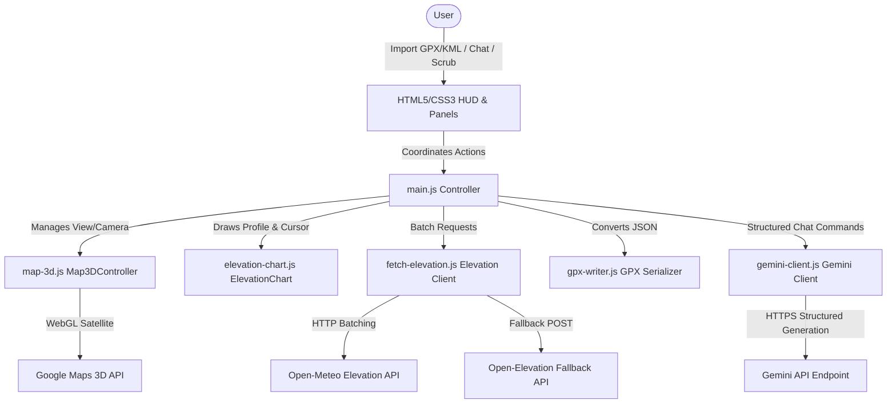

# 🗺️ Kokopelli's Ruff Terrain Explorer: Engineering Requirements Specification

This document details the reverse-engineered functional requirements, non-functional requirements, system architecture, data schemas, and mathematical algorithms of **Kokopelli** (also known as RuffTerrain), a premium WebGL-based 3D route visualizer and course architect.

---

## 1. Project Overview & System Context
**Kokopelli** is a client-side web application designed to help race directors, trail runners, and hikers import, enhance, and visualize remote trail courses in high-fidelity 3D. The application overlays routes onto 3D satellite terrain, calculates detailed safety metrics, and provides an interactive playback fly-through simulation. 

Additionally, it integrates with a generative AI agent (the **Gemini Course Architect**) to ingest unstructured text or PDFs (such as race web pages) and generate snaps, aid station lists, and safety attributes.

### Technology Stack
1. **Core Development**: Vanilla HTML5, CSS3, and modern modular ES6 JavaScript.
2. **Bundler**: Vite (Vite JS dev & production builds).
3. **Map Renderer**: Google Maps JavaScript 3D Maps API (`Map3DElement`, `Polyline3DElement`, `Marker3DInteractiveElement`, `Marker3DElement`) in `v1beta/alpha` hybrid mode.
4. **Elevation Profiles**: HTML5 Canvas API (custom drawing with device-pixel-ratio calibration).
5. **AI Integration**: Google Gemini API via HTTPS REST endpoints (`v1beta` models list and content generation).
6. **External Libraries**: PDF.js (via CDN link) for parsing client-side PDF document attachments in the chat interface.
7. **Elevation Services**: Open-Meteo Elevation API with Open-Elevation POST API as a fallback.

---

## 2. System Architecture & Components



The codebase is structured into the following decoupled modules:
- **`index.html`**: Entry point defining the page layouts, floating glassmorphic panels, SVGs, templates, and overlay modals.
- **`src/style.css`**: Design system tokens, glassmorphism filters, 3D compass CSS layout, metrics overlays, and responsive spacing.
- **`src/main.js`**: Core controller coordinator. Manages application state, handles event bindings, coordinates playback simulation, and controls local storage.
- **`src/gpx-parser.js`**: Parsing engine for GPX and KML. Implements distance calculations, snapped coordinates matching, multi-pass search loops, and safety warnings generation.
- **`src/gpx-writer.js`**: Serializer converting route state back into valid XML GPX format decorated with custom metadata namespace annotations.
- **`src/map-3d.js`**: Map controller encapsulating WebGL 3D Maps element. Drives camera tracking, SLERP rotation dampening, markers generation, and climb color-coding.
- **`src/elevation-chart.js`**: Interactive Canvas renderer. Draws elevation graphs, highlights warning zones, positions cursor guides, and translates screen coordinates.
- **`src/fetch-elevation.js`**: Elevation correction client. Fetches, interpolates, and filters terrain elevation data from external web APIs.
- **`src/gemini-client.js`**: AI client. Sends route context and instructions to the Gemini API, enforcing JSON output formatting matching the system's schema.

---

## 3. Data Schemas & Specifications

### 3.1 Course Architect Custom XML GPX Schema (`ca:`)
Kokopelli exports GPX files annotated with custom XML schema tags under the `xmlns:ca="http://coursearchitect.com/schema/v1"` namespace. These tags are appended to standard `<wpt>` (waypoint) tags inside `<extensions>`:

```xml
<wpt lat="40.0150" lon="-105.2705">
  <ele>1624.00</ele>
  <name>Resurrection Aid Station</name>
  <sym>icons/aid_station.svg</sym>
  <desc>Pass 1 at 7.24km (Outbound) | Pass 2 at 27.68km (Inbound)</desc>
  <extensions>
    <ca:station type="segmenting" id="resurrection" subtype="aid_station">
      <ca:passes>
        <ca:pass num="1" dist_m="7242" label="Outbound" cutoff_clock="9:15 AM" cutoff_elapsed="PT2H15M" />
        <ca:pass num="2" dist_m="27681" label="Inbound" cutoff_clock="1:15 PM" cutoff_elapsed="PT6H15M" />
      </ca:passes>
      <ca:accessibility crew_allowed="true" pacer_allowed="false" vehicle_tier="auto" drop_bag_allowed="true" />
      <ca:services water="true" unmanaged_water="false" food="true" hot_food="false" toilets="true" medical="true" sleep_area="false" />
      <ca:navigation_alert severity="info" turn_type="straight" prompt="Keep straight past reservoir road." />
    </ca:station>
  </extensions>
</wpt>
```

#### Schema Parameters:
- **`ca:station`**: Represents a physical waypoint. Attributes:
  - `type`: `segmenting` (major aid station dividing segments) or `informational` (landmark, water source).
  - `id`: Unique string identifier.
  - `subtype`: `aid_station`, `water_source`, `scenic`, `campground`, `refuge`, `summit`, `navigation`.
- **`ca:pass`**: Represents a timing pass at the station. Attributes:
  - `num`: Integer pass index (1-indexed).
  - `dist_m`: Cumulative distance from start in meters.
  - `label`: Pass description (e.g., "Outbound", "Inbound").
  - `cutoff_clock`: Clock time cutoff (e.g., "1:15 PM").
  - `cutoff_elapsed`: ISO 8601 duration relative to race start (e.g., "PT6H15M").
- **`ca:accessibility`**: Crew/pacer permissions. Attributes:
  - `crew_allowed`, `pacer_allowed`, `drop_bag_allowed`: Boolean string (`"true"`/`"false"`).
  - `vehicle_tier`: Access level: `"none"`, `"hike_only"`, `"foot_bike"`, `"auto"`, `"4wd"`.
- **`ca:services`**: Amenities checklist. Attributes: Water, unmanaged water, food, hot food, toilets, medical, and sleep area (all Boolean strings).
- **`ca:navigation_alert`**: Critical turn notices. Attributes:
  - `severity`: `"critical"`, `"warning"`, `"info"`.
  - `turn_type`: `"sharp_right"`, `"sharp_left"`, `"fork_right"`, `"fork_left"`, `"straight"`.
  - `prompt`: Directions description.

### 3.2 Gemini Response Schema (`GEMINI_RESPONSE_SCHEMA`)
All outputs from the Gemini chat client are constrained to conform to a strict JSON structure utilizing the following schema:

```json
{
  "stations": [
    {
      "id": "string",
      "name": "string",
      "type": "segmenting | informational",
      "subtype": "aid_station | water_source | navigation | scenic | campground | refuge | summit",
      "coordinate_override": {
        "lat": "number",
        "lon": "number"
      },
      "passes": [
        {
          "num": "integer",
          "dist_m": "number",
          "label": "string",
          "cutoff_clock": "string",
          "cutoff_elapsed": "string"
        }
      ],
      "accessibility": {
        "crew_allowed": "boolean",
        "pacer_allowed": "boolean",
        "vehicle_tier": "none | hike_only | foot_bike | auto | 4wd",
        "drop_bag_allowed": "boolean"
      },
      "services": {
        "water": "boolean",
        "unmanaged_water": "boolean",
        "food": "boolean",
        "hot_food": "boolean",
        "toilets": "boolean",
        "medical": "boolean",
        "sleep_area": "boolean"
      },
      "navigation_alert": {
        "severity": "critical | warning | info",
        "turn_type": "sharp_right | sharp_left | fork_right | fork_left | straight",
        "prompt": "string"
      }
    }
  ]
}
```

---

## 4. Mathematical Algorithms & Calculations

### 4.1 Spatial Coordinate Distance (Haversine Formula)
The distance $d$ in meters between two lat/lon coordinate pairs is calculated using the Haversine formula:

$$\Delta \phi = \frac{(\text{lat}_2 - \text{lat}_1) \cdot \pi}{180}$$
$$\Delta \lambda = \frac{(\text{lon}_2 - \text{lon}_1) \cdot \pi}{180}$$
$$a = \sin^2\left(\frac{\Delta \phi}{2}\right) + \cos\left(\frac{\text{lat}_1 \cdot \pi}{180}\right) \cdot \cos\left(\frac{\text{lat}_2 \cdot \pi}{180}\right) \cdot \sin^2\left(\frac{\Delta \lambda}{2}\right)$$
$$c = 2 \cdot \text{atan2}\left(\sqrt{a}, \sqrt{1 - a}\right)$$
$$d = R \cdot c$$

*Where $R = 6,371,000\text{ meters}$ (Earth's radius).*

### 4.2 Elevation Slope Grade Calculation
Slope grade (percentage) at a trackpoint is calculated over a stable **30-meter cumulative distance baseline** to filter out GPS noise and signal fluctuations:

$$\text{run} = d_{\text{current}} - d_{\text{base}}$$
$$\text{rise} = h_{\text{current}} - h_{\text{base}}$$
$$\text{grade} = \left(\frac{\text{rise}}{\text{run}}\right) \cdot 100 \quad (\text{if }\text{run} > 5\text{ meters})$$

*Where $d$ is cumulative distance in meters and $h$ is elevation in meters. The base index is found by walking backward until the cumulative distance difference is $\ge 30\text{ meters}$.*

### 4.3 Snapping Algorithms
#### Standard Snapping (`snapToRouteSegments`)
Finds the closest projection point on the route polyline. For each segment between trackpoints $A$ and $B$, project the point $P$:
1. Calculate vectors $\vec{v} = B - A$ and $\vec{w} = P - A$ in scaled coordinate space:
   $$x = \text{lon} \cdot \cos\left(\frac{\text{lat}_A + \text{lat}_B}{2} \cdot \frac{\pi}{180}\right)$$
   $$y = \text{lat}$$
2. Calculate projection fraction $t$:
   $$t = \max\left(0, \min\left(1, \frac{\vec{w} \cdot \vec{v}}{\|\vec{v}\|^2}\right)\right)$$
3. Project coordinates and interpolate elevation/distance:
   $$\text{lat}_{\text{proj}} = \text{lat}_A + t \cdot (\text{lat}_B - \text{lat}_A)$$
   $$\text{lon}_{\text{proj}} = \text{lon}_A + t \cdot (\text{lon}_B - \text{lon}_A)$$
   $$\text{ele}_{\text{proj}} = \text{ele}_A + t \cdot (\text{ele}_B - \text{ele}_A)$$
   $$\text{dist}_{\text{proj}} = \text{dist}_A + t \cdot (\text{dist}_B - \text{dist}_A)$$

#### Snap Windows
- **Local Constraint Window**: Filters segment iterations within $\pm3000\text{ meters}$ of the waypoint's nominal distance. This preserves pass direction (e.g. outbound vs. inbound passes in loop/out-and-back routes).
- **Full Course Search Fallback**: Iterates through all route segments if the local window yields no segments.

#### Turnaround Snapping
Waypoint passes explicitly labeled as `"turnaround"` snap directly to the trackpoint closest to the mathematical midpoint of the course distance:

$$d_{\text{target}} = \frac{d_{\text{total}}}{2.0}$$

#### Multi-Pass Snapping (`findMultiPassIntersection`)
Finds a trackpoint index near the first pass nominal distance $d_1$ that minimizes the aggregate spatial distance to all subsequent passes $d_k$ ($k > 1$):
1. Compute scaled nominal distances: $d'_k = d_k \cdot \text{scaleFactor}$.
2. Walk first pass search indices within range $[d'_1 - 1500\text{m}, d'_1 + 1500\text{m}]$.
3. For each candidate point $C$, calculate the minimum spatial distance to any trackpoint in the subsequent search ranges $[d'_k - 1500\text{m}, d'_k + 1500\text{m}]$:
   $$\text{Score}(C) = \sum_{k=2}^{M} \min_{T \in \text{Range}(d'_k)} \text{haversine}(C, T)$$
4. Select the candidate point index that minimizes $\text{Score}(C)$.

---

## 5. Functional Requirements Spec

### 5.1 Route File Ingestion & Processing
- **Format Support**: Import GPX (using trackpoints `<trkpt>` or routepoints `<rtept>`) and KML files (parsing `<coordinates>` tokens under `<LineString>` and waypoints under `<Placemark>`).
- **Elevation Smoothing**: Apply an **11-point moving average filter** (5 points on either side) to parsed trackpoint elevations to smooth out raw GPS noise.
- **Dynamic Detours**: When editing or adding waypoints, if the coordinates sit off-route:
  - If placed along a segment: splice new trackpoint coordinates into the route array, stretching the polyline to visit the waypoint and immediately return.
  - If placed near route boundaries: prepend or append coordinates to extend the course terminal bounds.
- **Elevation Correcting (Open-Meteo)**:
  - Batch API request payload size to **20 coordinate pairs** to avoid URL length failures.
  - Apply exponential backoff retries (3 retries starting at 1000ms delay).
  - Implement a **300ms throttle pause** between requests to obey API rate limits.
  - Downsample coordinates by sampling every **10th coordinate** to reduce bandwidth, then linearly interpolate intermediate elevations before applying the 11-point smoothing pass.

### 5.2 3D Map Renderer & Camera Simulation
- **Map Initialization**: Embed `Map3DElement` in Hybrid mode. Calculate bounds to set target camera range to fit the entire route overhead on load, looking straight down.
- **Compass Integration**: Embed a digital rotating compass overlay. Feed the Map 3D heading (`gmp-headingchange` event) directly into the compass cylinder rotation transform using 3D CSS:
  $$\text{CSS Transform} = \text{rotateY}(-\text{heading})$$
- **Climb Color Visualizer Toggle**:
  - Apply 10-point moving average smoothing to grades before drawing.
  - When **active**: Split the route polyline into discrete segments and color-code:
    - **Red**: Steep climbs (grade $> 2.5\%$)
    - **Green**: Descents (grade $< -2.5\%$)
    - **Blue**: Neutral segments (grade between $-2.5\%$ and $2.5\%$)
  - When **inactive**: Draw a solid cyan polyline (`#00d2ff`).
- **Interactive Waypoint Markers**:
  - Custom waypoints render as `Marker3DInteractiveElement` pins.
  - Enforce slotted `<template>` elements wrapping pure parsed `SVGElement` nodes (HTML wrappers or images are rejected by the WebGL renderer).
  - Pin colors map to type: Start (Emerald Green), Finish (Red), Medical (Rose Red), Food/Station (Royal Purple), Water (Cyan), Default (Blue).
  - Listeners map to `gmp-dragend` coordinates to trigger route metrics updates.
- **Camera Playback Loop**:
  - Playback simulation speed: $\text{simSpeed} = 20 \cdot \text{speedScale}^2\text{ m/s}$ (slider values 1-10 yields 20m/s to 2000m/s).
  - Update position using linear interpolation between trackpoints (`getInterpolatedPoint`).
  - Calculate camera heading dynamically by pointing the camera toward a lookahead point:
    $$d_{\text{lookahead}} = d_{\text{current}} + \max(50\text{m}, \text{avgSpacing} \cdot 3.5)$$
  - Apply **SLERP heading interpolation** to smooth out quick camera pivots around tight trail switchbacks.
  - Apply a **Bungee Lerp Filter** to camera coordinates center focus to smooth out jitters.
  - **Auto-Pause at POIs**: Automatically pause the playback thread when the simulation distance crosses the snapping distance of a waypoint. Open the POI detail modal and pause for the user-configured duration (default 5s, or indefinitely if set to 0).

### 5.3 Elevation Scrubber Chart
- **Canvas Rendering**: Draw on a high-DPI adjusted HTML5 `<canvas>` using `window.devicePixelRatio`.
- **Telemetry Indicators**: Highlight completed progress on the chart with a bold cyan line (`#00d2ff`) and gradient fill; show remaining progress in translucent grey.
- **Axes Labels**: Translate Y-axis (4 splits) and X-axis (5 splits) values dynamically on the canvas based on active units configuration (Metric vs. Imperial).
- **Interactive Tooltips**:
  - Mouse hover displays vertical scrubber line, white focal dot, and a card detailing cumulative distance, elevation, and grade.
  - Hovering within **15px** of a waypoint node highlights the dot and shows a detailed popover displaying the station name, distance, elevation, cutoffs, and available amenities icons (Water `💧`, Food `🍔`, WC `🚾`, Medical `➕`, Sleep `🛌`).

### 5.4 Safety Warnings Engine
Automatically evaluate courses for three safety warning categories on ingestion or recalculation:
1. **Resource Deserts**:
   - Gaps between successive resource-providing waypoints (Start, Finish, or stations supplying water or food) exceeding **5 miles (~8046.72 meters)**.
   - Triggers warnings for: (a) Start to first resource gap, (b) resource-to-resource gaps, and (c) last resource to Finish gap.
2. **Difficult Climbs**:
   - Climb segments starting when the slope grade exceeds **3.5%**.
   - Terminates the climb segment when: (a) descending $>20\text{ meters}$ below the peek, (b) flat segment length exceeds $200\text{ meters}$ since grade was last $>3.5\%$, or (c) route ends.
   - Calculates a difficulty score if climb length is $\ge 400\text{ meters}$ and gain $> 0$:
     $$\text{Difficulty Score} = \text{Elevation Gain (m)} \cdot \text{Average Grade (\%)}$$
   - Generates warnings for climbs with a score $\ge 100$. Categories: Moderate (100–250), Difficult (251–600), Severe (601–1500), Extreme ($>1500$).
3. **Spatial Mismatch**:
   - Triggered during Gemini AI coordinate overrides if the distance between the user-defined waypoint lat/lon and the nearest snapped GPX trackpoint exceeds **2000 meters**.
- **Map Focus**: Clicking any warning in the sidebar panel flies the 3D map camera directly to focus on the warning segment and draws a thick highlight polyline (width 14).

### 5.5 Gemini Course Architect Chat
- **Context Ingestion**: Compress route coordinates into a concise array of existing waypoints to fit the Gemini context window before sending chat messages.
- **Unstructured File Parsing**: Ingest uploaded `.txt`, `.csv`, `.gpx`, or `.pdf` attachments. Parse PDFs directly in the client browser using `PDF.js` text page extraction streams and submit the text contents to the Gemini API.
- **Multi-Pass Deduplication**: Merge multiple mentions of a single waypoint (e.g. outbound and inbound passes of an out-and-back) into a single entity containing a list of passes in the JSON array.
- **Temporal Duration Parsing**: Convert relative clock time cutoff text (e.g. "1:15 PM") to ISO 8601 durations relative to the race start.

---

## 6. Non-Functional Requirements

### 6.1 Performance Constraints
- **Polyline Downsampling**: Downsample long tracks on load to a maximum of **1500 points** for WebGL drawing to prevent browser thread freeze and GPU memory limits.
- **Flexbox Resize Loops**: Chart container dimensions must be calculated against a parent element with absolute positioning and fixed/flex boundaries to avoid triggering `ResizeObserver loop completed with undelivered notifications` rendering exceptions.
- **API Request Throttling**: Adhere to Open-Meteo and Open-Elevation rate-limiting policies by batching coordinate queries and applying wait timers.

### 6.2 User Experience & Accessibility
- **Design Tokens**: Standardize HSL variables (`--primary`, `--background`, `--card`, etc.) to build a premium, glassmorphic UI. Combine dark translucent backdrops (`backdrop-filter: blur(12px)`) with thin borders (`1px solid rgba(255, 255, 255, 0.1)`).
- **Measurement Units System**: Standardize core computations (meters, elevation change) strictly in metric. Apply Metric/Imperial conversions (miles, feet, kilometers) only at the rendering layers to prevent cumulative rounding drifts.
- **Edit Protections**: Implement a global edit lock toggle. When locked, drag behaviors on 3D map markers and chat-initiated route modifications are completely disabled.
- **Local Storage Configuration**: Maintain state persistence across page reloads by caching:
  - Maps and Gemini API keys.
  - Active units configuration.
  - Playback parameters (speed, camera range, camera tilt).
  - History queue containing the **10 most recently loaded courses** for fast retrieval.
